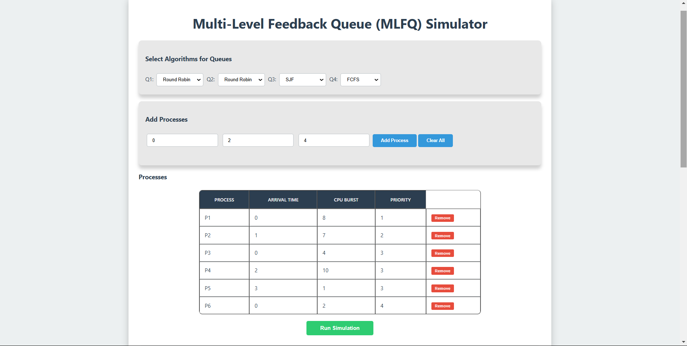
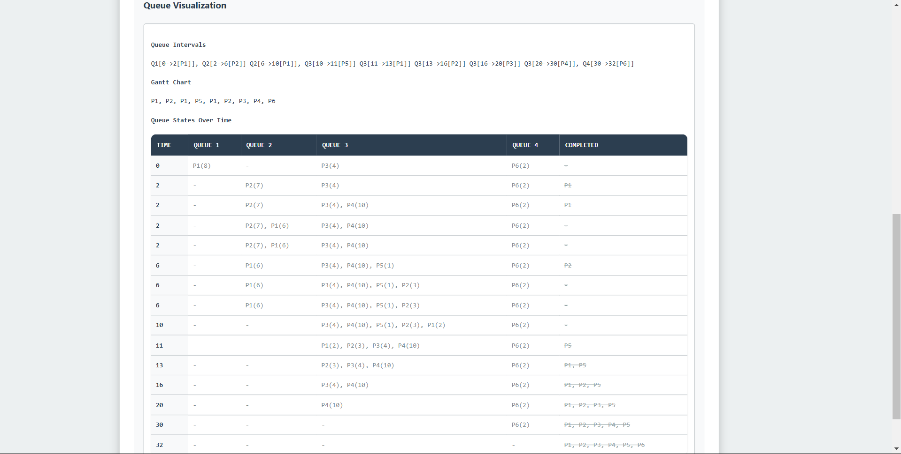

# Multi-Level Feedback Queue (MLFQ) Simulator

# LINK

https://67479447a6e901a89682cddf--dynamic-dango-9c1934.netlify.app/

This project is an interactive **Multi-Level Feedback Queue (MLFQ)** simulator implemented in **HTML**, **CSS**, and **JavaScript**. It allows users to visualize the execution of processes across multiple queues with different scheduling algorithms, providing detailed insights into scheduling behaviors.

---

---

---

---
## Features

- **Process Management**:
  - Add processes dynamically with attributes: *Arrival Time*, *CPU Burst*, and *Priority*.
- **Queue Configuration**:
  - Simulates **4 distinct queues**, each utilizing different scheduling algorithms:
    Round Robin (RR)
    Shortest Job First (SJF)
    Shortest Remaining Time First (SRTF)
    First Come, First Serve (FCFS)
- **Visualization**:
  - Displays the **Gantt Chart** in a textual timeline format, highlighting the process execution sequence.
  - Displays the **Queue Intervals**  in a textual timeline format.
  - Displays the **Queue Visualisation Table **  in a tabular form.
